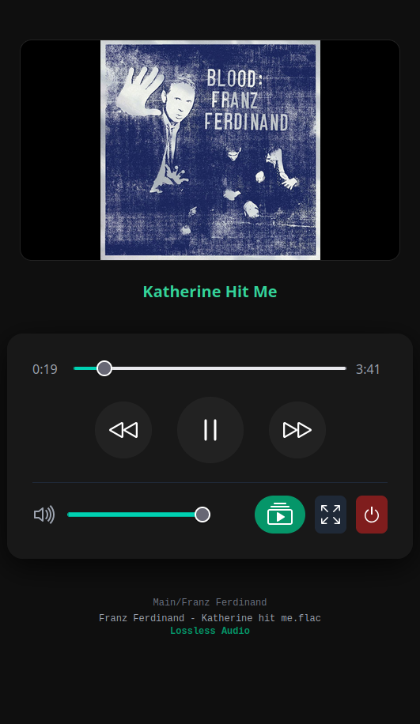
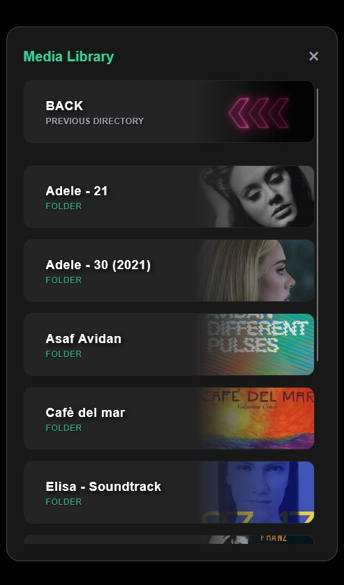

# MPV Remote

**Easy**, **Elegant** and **Minimalist**: MPV meets a powerful WebUI.

---

**MPV Remote** is a lightweight, web-based remote control and media browser designed specifically for the **mpv media player**. It allows you to transform your computer or a headless media server into a home theater system that you can control comfortably from your smartphone or any browser. It works on Linux and Windows. Developed on Linux Mint, it should work on any modern Linux distribution (such as Ubuntu, Debian, or Fedora) that supports Python 3 and mpv and also on Raspberry.

---
## Screenshots

<p align="center">   </p>
<p align="center">   </p>


## Key Features

* **Sleek & Comfortable UI**: Designed with a "Volumio-inspired" dark aesthetic. Enjoy a visually pleasing interface with smooth transitions, neon accents, and a focus on content.
* **Media Library with Style**: Browse your files with ease. The UI automatically handles folder thumbnails (using `folder.jpg`) and applies a sophisticated glass-morphism effect with faded covers.
* **Live Preview**: Get a preview screenshot of what’s playing directly on your remote device—perfect for managing media from another room. If you are playing videos, the screenshot will be automatically updated every five seconds.
* **Complete Control**: Full management of playback (play/pause, seek, volume, fullscreen, stop, and quit).
* **Instant Setup**: No complex databases. No heavy dependencies. You need only python, and mpv. It scans your media folder directly and communicates with mpv via IPC socket.

---

## Quick Start

**LINUX USERS**: Make sure you have `mpv`, `python3` installed on your system.

**WINDOWS USERS**: A pre-compiled version of `mpv` is available in the `mpv\` folder as a ZIP archive. Please extract it within that folder. If you don't trust the included version, you can specify the path in `config.json` where your trusted version is placed, or overwrite the bundled version with another one.

1. Clone this repository.
2. Place your media (or link your media folder) to the path defined in `config.json` (default: `./media`), or edit `config.json` and set the correct path of your media folder.
3. Launch the application
4. Open your browser and navigate to `http://<your-ip>:5000`, and enjoy!

```bash
git clone https://github.com/TheFax/MPV-Glass-Remote.git
cd MPV-Glass-Remote
python3 mpv_remote.py
```

---

## config.json

The `config.json` file allows you to customize various settings for MPV Remote. Below is a detailed explanation of each configurable option:

*   **`LINUX_media_dir`**: Specifies the path to your media directory on Linux systems. This is where MPV Remote will look for your audio and video files.
    *   **Default**: `./media`
    *   **Example**: `"/home/user/Videos"`

*   **`LINUX_mpv_executable`**: Defines the command or path to the MPV executable on Linux.
    *   **Default**: `"mpv"` (assumes `mpv` is in your system's PATH)
    *   **Example**: `"/usr/local/bin/mpv"`

*   **`WINDOWS_media_dir`**: Specifies the path to your media directory on Windows systems.
    *   **Example**: `"C:\\Users\\YourUser\\Music"` (Note the double backslashes `\\` are required in JSON for path separators)

*   **`WINDOWS_mpv_executable`**: Defines the path to the MPV executable on Windows.
    *   **Default**: `".\\mpv\\mpv.exe"` (points to the bundled mpv in the `mpv\` folder)
    *   **Example**: `"C:\\Program Files\\mpv\\mpv.exe"`

*   **`allowed_extensions`**: A list of file extensions that MPV Remote will recognize as playable media. Only files with these extensions will be displayed in the media library.
    *   **Default**: `[".mp4", ".mkv", ".avi", ".mov", ".m4v", ".mp3", ".flac", ".ogg", ".wav", ".m4a"]`
    *   **Example**: `[".mp3", ".flac", ".ogg", ".wav", ".m4a"]` (for an audio-only setup)

*   **`autoplay_extensions`**: A list of file extensions that trigger the automatic playlist generator. MPV will play the file you clicked and when it is finished, it continue with next files in the same folder.
    *   **Default**: `[".mp3", ".flac", ".ogg", ".wav", ".m4a"]`

*   **`autoplay_max`**: If automatic playlist is triggered, it adds a maximum amount of file in the list. This is useful to avoid creating a playlist with hundreds of songs if you click on a file in a folder with a huge amount of media.
    *   **Default**: `20`

*   **`port`**: The port number on which the web interface will be accessible. If this port is already in use, the application might fail to start.
    *   **Default**: `5000`

*   **`audio_device`**: Allows you to specify the audio output device for mpv. Set to `"auto"` to let mpv choose the default audio device. You can find available device names by running `mpv --audio-device=help` in your terminal.
    *   **Default**: `"auto"`
    *   **Example**: `"alsa/default"` (for a specific ALSA device on Linux) or `"wasapi/{00000000-0000-0000-0000-000000000000}"` (for a WASAPI device on Windows, replace with actual device ID).

---

## Philosophy

The main goal of **MPV Remote** is to make the media experience *effortless*.

I am a minimalist when it comes to dependencies. I firmly believe that using a piece of software shouldn't require you to be a programmer or a sysadmin. This project is built for the end-user who values efficiency over complexity: that means no npm, no Docker, and no massive dependency chains to manage. You shouldn't have to install gigabytes of middleware just to perform a simple task. My goal is a "plug-and-play" experience where the code stays out of your way.

* **Extra-Easy**: This application is absolutely easy to start and use.
* **Visual Hierarchy**: Large control buttons for touch screens.
* **Smart Thumbnails**: If a folder contains a `folder.jpg`, it becomes the background of the card, creating a premium "Netflix-style" browsing experience.
* **Responsive**: Works beautifully on iPhones, Android devices, and Tablets.

---

## Why I Built This

I started this project because I couldn't find a media controller that felt "just right." I wanted something that combined the aesthetic appeal of high-end systems with the raw performance of a lightweight script.

### The Problem with Existing Solutions

* **Volumio**: While it looks great, I found it to be quite **heavy** and **not very user-friendly** for quick setups. Most importantly, it is strictly limited to **audio only**, leaving no room for a complete media experience (for video I mean).
* **Kodi**: It is an incredible piece of software, but it has become **bloated** over the years. You can literally get lost in its endless menus and settings. Furthermore, despite its complexity, it often lacks an **optimized flow for music playback**, making it feel clunky for daily use.

### My Goal

I wanted a "third way": a tool that provides the **visual elegance** of Volumio but with the **simplicity** of a single Python script. By using **mpv** as the engine, I gained the ability to play literally any file format (video or audio) without needing hundreds of megabytes of background processes or complex configurations.

It's just you, your Python interpreter, and your media. No Node.js, no Docker, no headaches.

---

## Technical info

* **Backend**: Python
* **Frontend**: HTML5, Tailwind CSS, JavaScript
* **Player**: MPV (via JSON IPC)

While the core logic is Linux-centric, it could potentially run on **macOS** with minor adjustments to the media paths and socket locations, provided `mpv` is installed via Homebrew. However please note that this has not been tested on macOS (yet).

---

## License

This project is open-source. Feel free to fork it, or modify it and help me to improve it!
